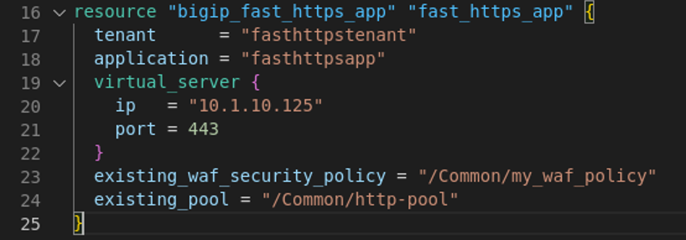

# Questions and Answers

**module 1**
Question: Would you use a FAST 'examples' template in production?
Answer: The description says "no". The reason behind it is that these templates are defined in a way which does not provide a good working practise for production environments. It is highly encouraged to create your own custom FAST templates.

**module 2**
Question: Which product module(s) is this template able to support?
Answer: LTM Only. This is because only LTM has been provisioned. The HTTP-Application-Template will adjust template options accordingly to the product modules provisioned.

Question: Are you able to deploy succefully in step 6?
Answer: No.

Question: What is possibly the reason?
Answer: The simple-http template is not developed to in such a way that it allows sharing of pools within the same or a different tenant.

Question: What was added?
Answer: Because the ASM module has been provisioned, HTTP-Application-Template now shows WAF options which can get included in the application service deployment.

**module 3**
Question: What is the status of both the Blue and Green pool?
Answer: Red.

Question: Does the Green pool contain pool members?
Answer: No.

Question: So, why does the Green pool not contain any pool members?
Answer: Event-Service-Discovery expects an additional piece of declaration which includes the pool members for pool Green.

Question: What is the Green pool status?
Answer: Green.

Question: How many poolmembers does pool Green have?
Answer: One.

Question: How is the the load being spread?
Answer: The load is equally spread among the pools.

Question: Is this according to the `distribution rate` set in the blue-green template?
Answer: Precentage = 0.5 this creates an equeal spread of the load among the pools.

**module 4**
No Questions

**module 5**
Question: What version of FAST is being used?
Answer: v1.24

Question: Why is AS3 version info being published here?
Answer: FAST runs on top of AS3.

Question: What more is shown through 'info'?
Answer: All available templates.

**module 6**
Question: What is the latest version of the BIG-IP provider?
Answer: v17.1

Question: What features do the BIG-IQ resources cover?
Answer: BIG-IQ License Manager and BIG-IQ AS3.

Question: For which product modules does the BIG-IP provider have specific resources?
Answer: LTM and WAF.

Question: Where can you find the resources for FAST?
Answer: Underneath F5 Automation Tool Chain (ATC).

Question: In the BIG-IP provider resource F5 ATC, how differs resource **bigip_fast_application** from the resource we just used **bigip_fast_https_app**?
Answer: bigip_fast_application uses a JSON based body where bigip_fast_https_app uses native terraform syntax.

Question: What is the benefit of the new templates like bigip_fast_http_app, bigip_fast_https_app, bigip_fast_tcp_app and bigip_fast_udp_app opposed to the older bigip_fast_application?
Answer: Teraform will not be able to track changes in a JSON based template and therefore no updated template wil get deployed when this is JSON based. The native Terraform FAST templates are therefore highly recommended as the to go for solution.

[PREVIOUS](../docs/module_6.md)      [BACK to README](../README.md)