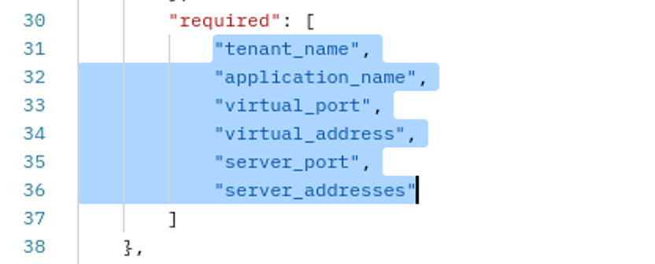

# Module 5 - Deploy FAST through REST-API

## Task 1 - Exploring FAST through an API

**Step 1:** Go to the FAST GUI on the BIG-IP and select tab **API** and explore the available options

**Step 2:** Use an RDP session to login to the **Ubuntu Jumphost** and select **Postman** from the desktop.

**Step 3:** In the **FAST** collection select **FAST via API** and select **GET FAST info** and hit **Send**.

Questions:
- What version of FAST is being used?
- Why is AS3 version info being published here?
- What more is shown through 'info'?

**Step 4:** Select the next REST-API request to **GET simple/http template details** and explore how a template is built.

# Task 2 - Deploy FAST via API

**Step 1:** Copy the objects mentioned in the **"required"** (starting at line 30) as shown in the picture and copy this in according to the instructions in the next step.

**Step 2:** Paste the copied objects in the next Postman REST-API request **Deploy 'simple/http' application** at the given point in the JSON body of the declaration.

**Step 3:** Adjust the values of the JSON body accordingly to the following table.

Name|Value
---------|---------
tenant_name|tenant1
application Name|new-http-app
virtual_port| 80
virtual_address| 10.1.10.110
server_port| 8086
server_address|10.1.20.4

Your JSON body should look like underneath example.

**Step 4:** Once you added the values to the JSON body and completed it. Copy and paste it into **Postman > FAST via API > Deploy 'simple_http' application** and POST it by hitting **Send**.

**Step 5:** Check if the new application got deployed at the BIG-IP.

## Task 3 - (Optional) Deploy FAST with F5 Extension

Instead of using Postman, you can use VSC to deploy DO, AS3 and FAST decalarations using the F5 Extension.

**Step 1:** Login to the **Ubuntu Jumphost** and start **VSC**.

**Step 2:** **G0 to VSC > Extensions** (four squares at the left pane) and search for **F5 Extension** and install it.

**Step 3:** The F5 Extension is now installed an you can click on the F5 icon in the left pane.

**Step 4:** Hover over the text **F5 Hosts** and select the appearing '+' sign. A field pops-up.

**Step 5:** Fill in **admin@10.1.1.5** in the field and hit **Enter**.

**Step 6:** Select the new value undernetah **F5 Hosts** and a new pop-up window appears. Fill in the BIG-IP password (**F5demo123!**) and hit **Enter**.

**Step 7:** Create a new file called **fast-f5extension-app.json** in VSC.

**Step 8:** Copy the JSON body from the previous task and paste it into the new created file. Don't deploy, first change it.

**Step 9:** Change the parameter values to the following and save the file before deploying.

Name|Value
---------|---------
tenant_name|tenant1
application Name|fast-f5extension-app
virtual_port| 80
virtual_address| 10.1.10.120
server_port| 8081
server_address|10.1.20.4

**Step 10:** Right click your mouse and select **Deploy Fast App** from the list to deploy the **fast-f5extension-app**.

**Step 11:** Check the BIG-IP FAST GUI if the Application got deployed and test it.

**Step 12:** Delete the Application via the FAST GUI.

[PREVIOUS](../docs/module_4.md)      [NEXT](../docs/module_6.md)